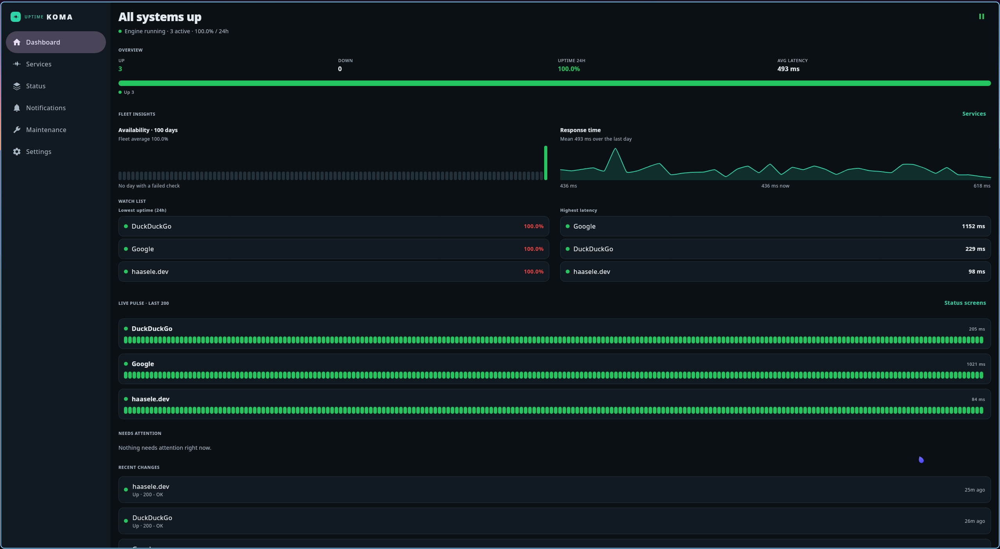

# Uptime Koma

A native rewrite of [Uptime Kuma](https://github.com/louislam/uptime-kuma) as a Kotlin Multiplatform app with Compose Multiplatform UI. The monitoring engine, database and notifications live in shared Kotlin; Android, iOS and Desktop share the same screens. There is no Node.js and no web view in the runtime path.

## Roles

| Platform | Role |
| --- | --- |
| Desktop (JVM) | Full 24/7 server: engine, tray, autostart, embedded HTTP (push / metrics / status JSON / remote UI) |
| Android | Local engine while the app (or foreground service) runs; can also drive a desktop over remote UI |
| iOS | Same UI; background polling is best-effort — prefer a headless desktop for always-on checks |

## Build

Full command list and output paths: **[docs/BUILD.md](docs/BUILD.md)**.

Build with the Kotlin Toolchain (`./kotlin`):

```bash
./kotlin build -p jvm
./kotlin test -p jvm -m shared
_JAVA_AWT_WM_NONREPARENTING=1 ./kotlin run -m desktopApp
./kotlin run -m desktopApp -- --nogui --port 3001
./kotlin run -m desktopApp -- --nogui --https /path/to/keystore.p12 --port 8443 --debug
./kotlin build -p android -m androidApp
```

Package:

```bash
./kotlin package -p jvm -m desktopApp -f executable-jar
./kotlin package -p android -m androidApp -f aab
```

Outputs land under project-root **`build/`** (compiled classes in `build/artifacts/…`, JARs in `build/tasks/…`). Details: [docs/BUILD.md § Build outputs](docs/BUILD.md#build-outputs).

`composeApp` is the multiplatform UI library; `desktopApp` is the desktop shell; the installable Android app comes from `androidApp`.

### Desktop CLI

Same flags for JAR, jpackage binary, AppImage and Flatpak (`DesktopLauncher`).  
Example with the packaged JAR:

```bash
java -jar build/tasks/_desktopApp_executableJarJvm/desktopApp-jvm-executable.jar --help
java -jar …/desktopApp-jvm-executable.jar --nogui --port 3001
java -jar …/desktopApp-jvm-executable.jar --port 8443 --https /etc/koma/keystore.p12
java -jar …/desktopApp-jvm-executable.jar --nogui --http --port 3001 \
  --hostname monitoring.example.com,srv-monitor01.lan --debug
```

| Flag | Explanation |
| --- | --- |
| *(none)* | Opens the GUI. Engine and optional embedded server follow **Settings**. |
| `--nogui`, `--headless` | No window / no AWT. Runs the monitor engine and the embedded HTTP(S) API only (push, metrics, status JSON, remote UI). Defaults to plain `--http` if neither `--http` nor `--https` is set. |
| `--port <n>` | Listen port (`1`–`65535`). **Implies `--nogui`** (web-service-only process). Also accepted as `--port=3001`. |
| `--http` | Force cleartext HTTP for the embedded server. Default when using `--nogui` / `--port` without `--https`. Cannot be combined with `--https`. |
| `--https <cert>` | Force HTTPS. `<cert>` is a PKCS12 keystore (`.p12` / `.pfx`) **or** a PEM certificate (private key: sibling `key.pem` / `<name>.key`, or the same PEM). Also `--https=/path/to/cert`. |
| `--hostname <list>`, `--hostnames <list>` | Comma-separated public DNS names (e.g. `monitoring.example.com,srv-monitor01.lan`). Used for the HTTP `Host` allowlist and the advertised URLs (“Exposed as” / CLI-managed banner). Also `--hostname=a,b`. Requires `--http`, `--https`, `--nogui` or `--port`. |
| `--debug` | Verbose logging (slf4j `DEBUG` + Koma engine events). Set before loggers initialize. |
| `-h`, `--help` | Print help and exit. |

**Behaviour notes**

- With `--http` / `--https` / `--port` / `--nogui`, the CLI **owns** the listen socket: Settings cannot start/stop or retarget that server for this process (CLI-managed URLs are shown instead).
- PKCS12 password: environment variable `KOMA_HTTPS_PASSWORD` (default `changeit`).
- Flatpak + HTTPS: grant the cert path, e.g. `flatpak run --filesystem=host:ro dev.haasele.KomaNative -- --https /path/to/cert …`.
- Enable remote UI in Settings, then connect with `ws(s)://<host>:<port>/api/remote`.

**Useful environment variables**

| Variable | Explanation |
| --- | --- |
| `_JAVA_AWT_WM_NONREPARENTING=1` | Required on Wayland (niri / xwayland-satellite) so AWT windows behave correctly. Export in the shell or compositor `environment { }` so the process does not need a re-exec. |
| `KOMA_HTTPS_PASSWORD` | Password for `--https` PKCS12 keystores (default `changeit`). |
| `GDK_SCALE` / `GDK_DPI_SCALE` | Optional GTK scaling hints for the tray stack on Linux. |

Wayland / niri details: [docs/BUILD.md § Wayland](docs/BUILD.md#wayland-niri--xwayland-satellite).

## Remote UI

1. On the desktop: Settings → allow remote UI clients → copy the access token.
2. On the phone: Settings → Open remote console → enter `http://<desktop-ip>:3001` and the token.
3. Pause / resume monitors and start / stop the engine from the console.

## Backup

Settings → Backup exports monitors, notification channels, status screens, tags and maintenance windows as JSON (no heartbeats). Paste the JSON on another instance to import.

## Stack

- Kotlin Multiplatform + Compose Multiplatform (Kotlin Toolchain / Amper layout)
- SQLDelight (SQLite; generated sources committed under `shared/src`)
- Ktor Client / Server
- kotlinx-coroutines + kotlinx-serialization

---

### Screenshots

